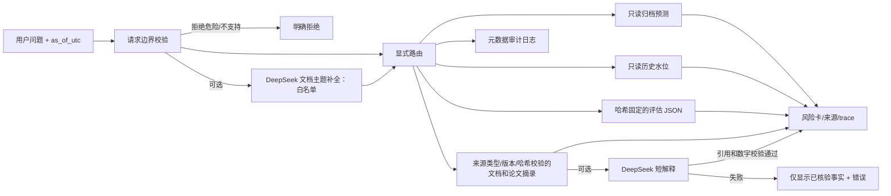

# 架构、数据流与信任边界

## 边界

`app/router.py` 是唯一问答编排入口。意图校验先于任何数据工具或 LLM；没有任意 SQL 或文件写入工具。`app/archive.py` 与 `app/replay.py` 用 SQLite 只读连接；`app/read_tools.py` 的 MAE 来源是固定 SHA-256 的 JSON 快照。预测回放要满足 `generated <= as_of`、`stored <= as_of <= valid_until`；声纳要同时满足观测与入库时间不晚于 `as_of`。预测的未来**目标时间**允许晚于 `as_of`，因为那是当时生成的未来预测，不是未来实测。

`app/knowledge.py` 检查目录记录的来源类型、有效版本、文件路径和 SHA-256。论文条目额外带 PDF 文件页和原件 SHA-256；本机有源 PDF 时会复核指纹，移植项目只带经核对的摘录。目录是维护者控制的配置，不接受用户上传。官方 GOV.UK 条目是当时核对过的**静态服务说明**，不代表当前警报状态。可选 DeepSeek 先做白名单文档主题补全，再把检索片段当数据生成短解释；返回还需通过引用 ID、逐字引文、数字和部分禁用语句的机械检查。这些检查不能证明所有语义断言正确，所以回答保留“已核验事实”和“模型解释”的区别。

`logs/requests.jsonl` 是应用唯一的常规持久写入点，仅记录请求元数据与 trace；它不在数据工具权限内，也不纳入 Git。备份、原始数据库和演示数据包不会被问答流程修改。

## 可追溯字段

每个完成的查询有 `request_id`、UTC 请求时间、问题 SHA-256、路由步骤和状态。预测 trace 记录 `run_id`、回放 UTC、预测生成与入库 UTC；水位记录观测与入库 UTC；评估记录范围、版本和源文件哈希；文档记录引用 ID、来源类型、版本与精确定位。失败 trace 记录步骤与错误类型，界面显示易读失败原因。
